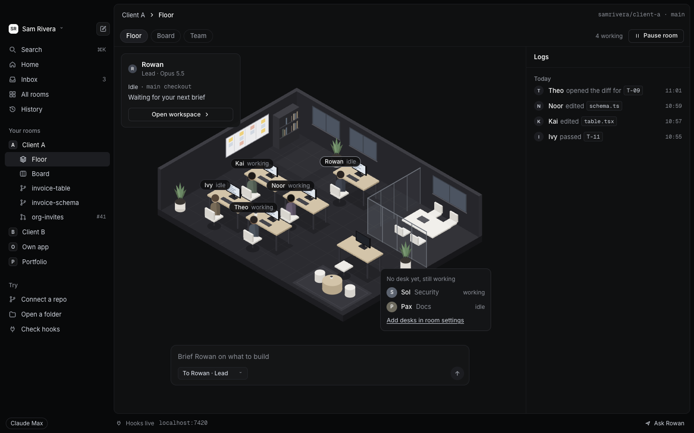
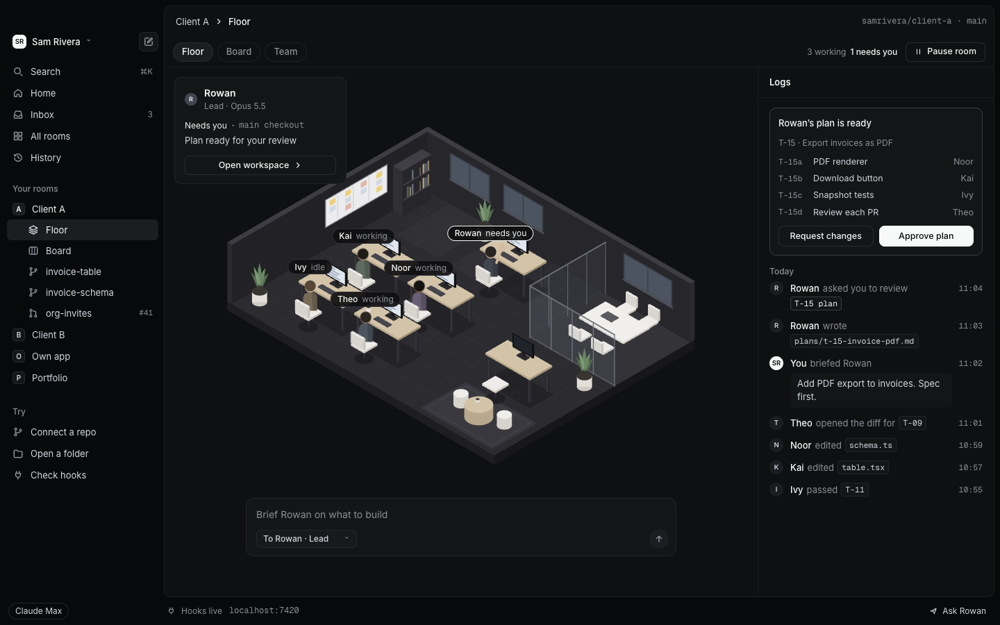
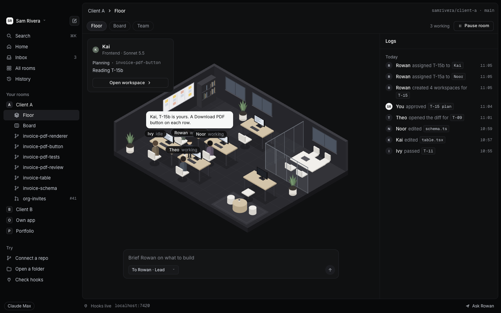
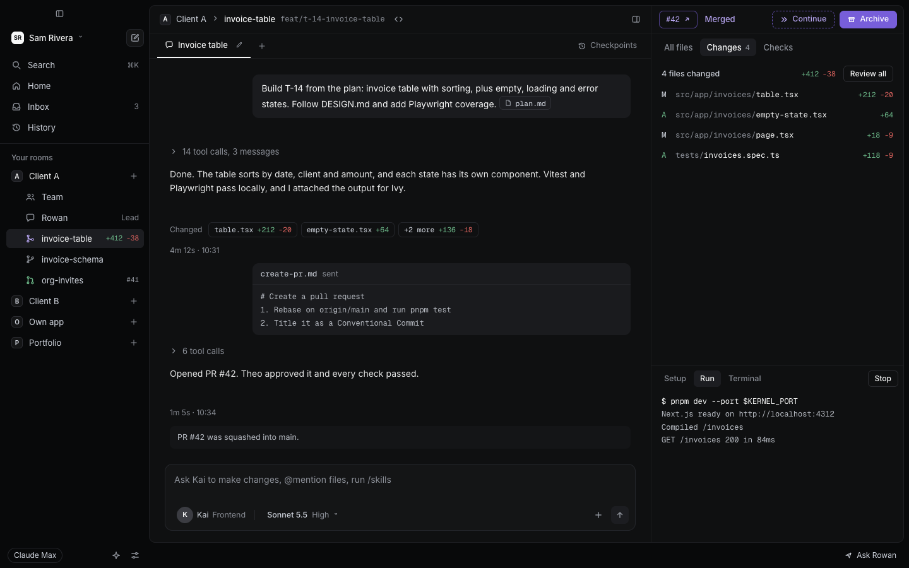
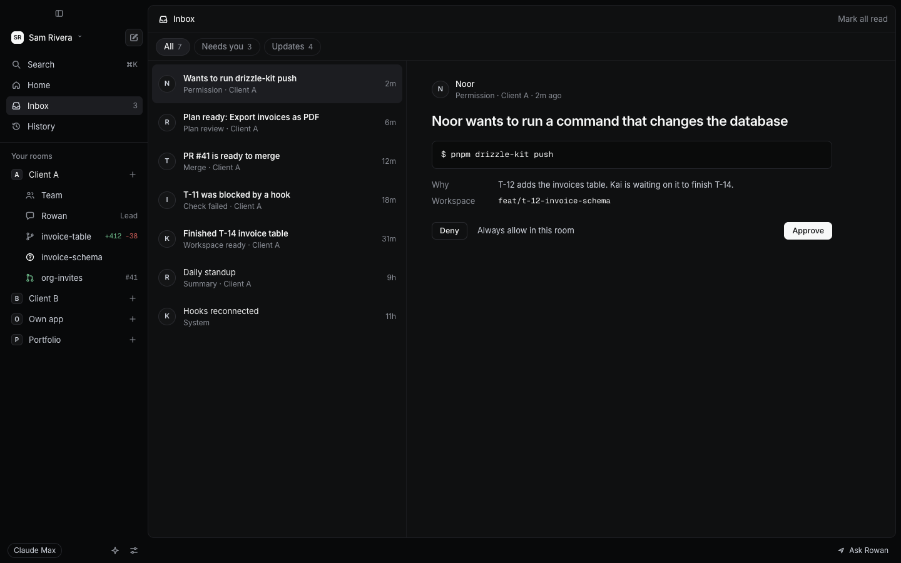
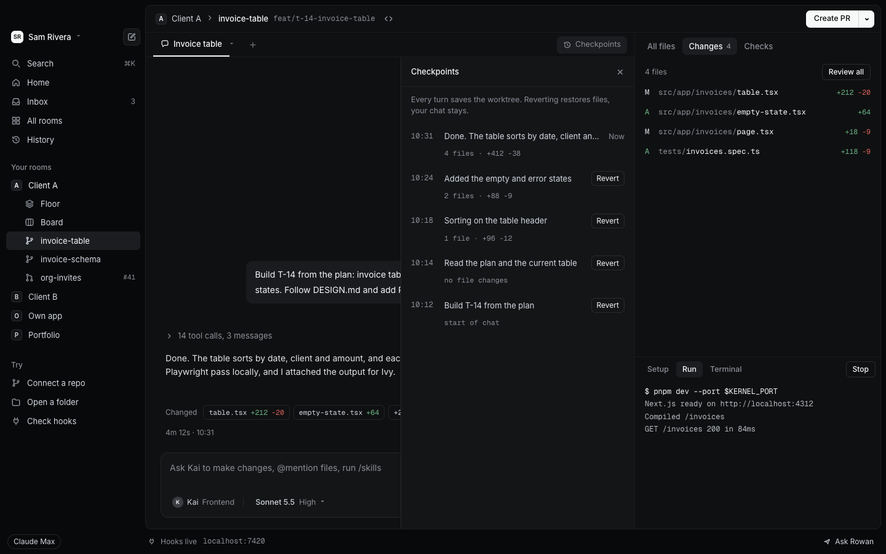
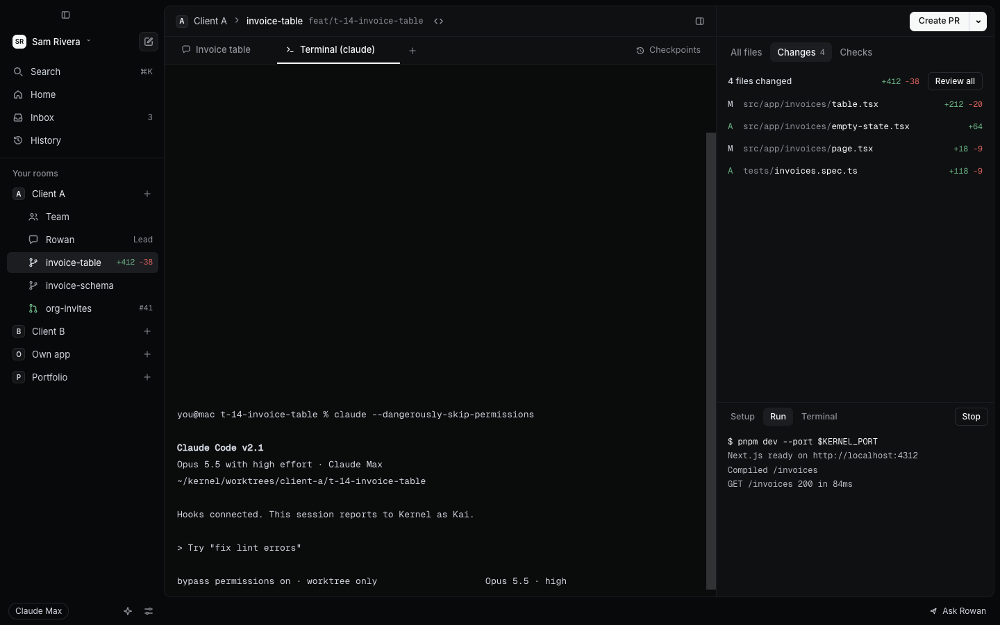

# Kernel

Kernel turns Claude Code into a small software team that works in an office on your Mac. You brief the Lead, approve a plan, and agents build in their own git worktrees, ask before anything risky, open pull requests and wait for you to merge.

**[Download Kernel for Mac (Apple silicon)](https://github.com/cjjutba/kernel/releases/latest/download/Kernel-arm64.dmg)** · [Website](https://kernel.cjjutba.dev)



## Requirements

- A Mac with Apple silicon, on a recent version of macOS
- [Claude Code](https://docs.claude.com/en/docs/claude-code) 2.1.80 or later, signed in with a Claude plan
- git
- The [GitHub CLI](https://cli.github.com) (`gh`), signed in, for pull requests

On first launch Kernel checks Claude Code, your sign-in and the GitHub CLI, and tells you how to fix whatever is missing.

## How it works

### The floor

Each repo you add is a room. Its floor is an isometric office where every agent in the repo's `.claude/agents/` folder has a desk. Agents sit down when they work, walk over when they hand off, and raise a hand when they need you. Everything on the floor comes from real Claude Code events. Nothing animates on a timer, so an idle agent looks idle.

### Rowan plans and hands off

Rowan is the Lead. Brief Rowan from the floor in a sentence or two, and Rowan works out a plan in plan mode and brings it to you. You approve it or ask for changes. Once you approve, Rowan creates one workspace per task and walks each one over to the right teammate.





### Workspaces and pull requests

A workspace is one task: a git worktree on its own branch, with its own port for the dev server. You can chat with the agent, read the diff file by file, run setup and run scripts, and open a pull request when it's ready. Checks show up in the workspace. After the merge, archive the workspace and it moves to History.



### The Inbox

Anything that needs a decision lands in the Inbox: a command an agent wants to run, a plan to review, a question, a PR that's ready to merge. You can approve a command once or always allow it in that room. Nothing merges by itself.



### Checkpoints and the big terminal

Kernel snapshots the worktree after every agent turn. If a turn goes wrong, revert to an earlier checkpoint and the files go back while the chat stays. When you want plain Claude Code, open a terminal tab in the workspace. It runs `claude` in the same worktree, and the session still shows up on the floor.





## Privacy

Kernel runs on your own Claude plan, using the Claude Code login you already have. There is no Kernel account and no Kernel server. Your rooms, chats, settings and history stay in a local database on your Mac.

Kernel itself makes these network calls and no others:

- Claude Code, which talks to Anthropic as it always does
- `gh`, for pull requests and checks
- git, to fetch and push branches on your repo's own remote, and your package manager when a new room installs dependencies
- The update check, which reads this repo's GitHub Releases
- An offline check, a DNS lookup of `api.anthropic.com`
- Linear, only if you connect it in Settings

## Build from source

You need Node 22 or later and the Xcode command line tools.

```sh
git clone https://github.com/cjjutba/kernel.git
cd kernel
npm install
npm run dev
```

`npm install` also rebuilds the native modules for Electron. `npm run dist:mac` builds an unsigned app into `dist/`. See [CONTRIBUTING.md](CONTRIBUTING.md) for tests and pull requests, and [docs/RELEASING.md](docs/RELEASING.md) for signed releases.

## How Kernel was built

Claude Code agents built Kernel one Linear issue at a time, working from a canvas of 119 screen designs. [docs/DECISIONS.md](docs/DECISIONS.md) records every choice someone might later want to undo, with the reason. It is kept as it was written.

## License

Kernel's source is available under the [Elastic License 2.0](LICENSE.md). In plain terms:

- You can use Kernel for free, fork it, modify it and self-host it, for personal or commercial work.
- You can't sell Kernel to others as a hosted or managed service.
- You can't remove or work around license keys, if Kernel ever has them.

This summary isn't the license. [LICENSE.md](LICENSE.md) is.
